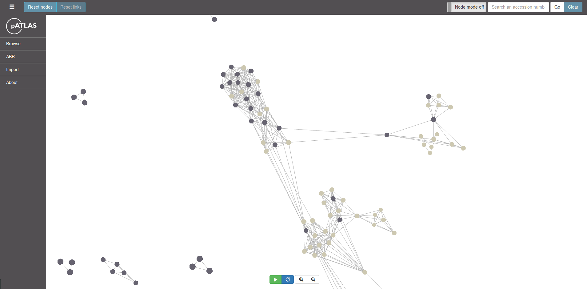

# Browse

Browse functions allow the user to explore the plasmid database used by 
plasmid ATLAS (pATLAS). pATLAS uses _refseq_ plasmid database from [NCBI]() 
to establish the relationships between all plasmids available in the database
. For that, it uses [MASH]() to estimate the pairwise distances between all 
plasmids. For a more detailed explanation on how are these relationships 
handled and displayed, please refer to [Relationships and distances estimations]
(distances.md)

## By Distances

Distances are represented in **pATLAS** as grey links between nodes (dark grey 
circles). This options allows the user to display how closely related are a 
group of plasmids or a plasmid with another plasmid. It has three color 
schemes options: blue, green and red. You may choose which one you see fit. 

They might be selected using a simple dropdown menu:

GIF

The darker the color is the smaller is the distance estimated by MASH and thus 
the more closely related (more similar) are the two plasmids that are linked 
by the link.

_Example_

## By Length

You may also filter by lenght of the plasmids present in the database. To do 
so, you select the **By Length** option under the **Browse** submenu, which 
will open a smaller windows above the visualization. Then, you may use both 
the slider and the boxes for minimum and maximum limits which will change the
 selected nodes (plasmids). Dark grey plasmids are within the current 
 interval of selected lengths, whereas ligher grey plasmids are outside the 
 selected interval.
 
 GIF
 
 _Example_
 
 
 
## By Taxa

In this option you may select a multitude of taxa filters ranging from order,
 family, genus to species. This will select with different colors each of the
  selected taxa. For instance, if you select _Borreliella afzelii_ and 
  _Borreliella garinii_, this will color plasmids identified in the each 
  of the two species with different colors.
  
  _Example_
  
  
  
  *NOTE:* However, if you select one genus and a species, or a family and a 
  species 
  (and so on), this will color all the selected plasmids in red.