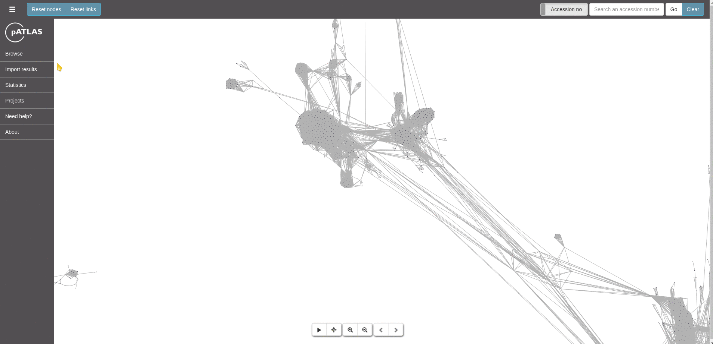

# Projects

You can save your current session and load it at a different time.
Users may make multiple selections using multiple
filters, such as `Taxa`, `Resistance` or even results from **file
Imports**, and visualize them later or share with someone in a different
computer.

## Saving a project

To save a project after making a custom selections go to the [Sidebar Menu](Sidebar.md)
and select Projects -> Export. You can save your project with a custom name
or, if the project name text box is left empty, it will be saved with the
default name: `my-patlas-project.json`.



### Version

Project files save information o the current pATLAS version.

## Importing a project

Once you have a project generated in pATLASm you can load it through
the [Sidebar Menu](Sidebar.md) and select Projects -> Import.
After selecting the file you wish to import and the **view** that you
wish to use on the first interaction, the project will be loaded into pATLAS.


### Version

Project files contain a `version` field that is used to make sure that
everything should work in the current pATLAS version available in
www.patlas.site. Some functions may change between versions and thus
with this version checking the user will be warned if the project
version is different from the current pATLAS version.

### Views

**Views** are abstractions used so that different layers selection layers can
be seen on each node (plasmid). It simplifies the visualization of many selections (e.g.
Taxa + Resistances + Imported file) in the node graph so that
it won't be overpopulated with information. **views** allows for the filters to be displayed
at once. In this sense, you can select Taxa view as the first view after importing a file
and the nodes will be colored by Taxa. Other views may be selected through the dropdown menus.

## Advanced usage

### Use custom selections through project files

Selections can be made in specific menus by importing a project file
instead of selecting many options in the drop down menus.

#### Usage example

To select 50 taxa to be visualized in the node graph, instead of
clicking 50 times in the drop down menu you may use the project import option
by providing  file with the following structure:

```
{
  "taxa": ["Escherichia coli", "Staphyloccocus aureus", ...],
  "resistance": false,
  "plasmidfinder": false,
  "virulence": false,
  "intersection": false,
  "union": false,
  "mapping": false,
  "mashscreen": false,
  "assembly": false,
  "consensus": false
}
```
