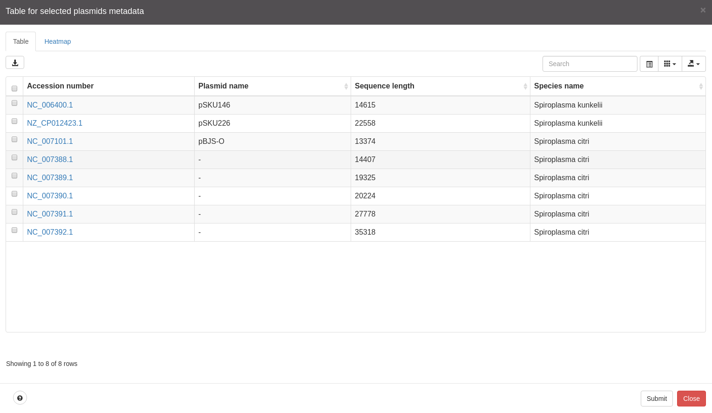
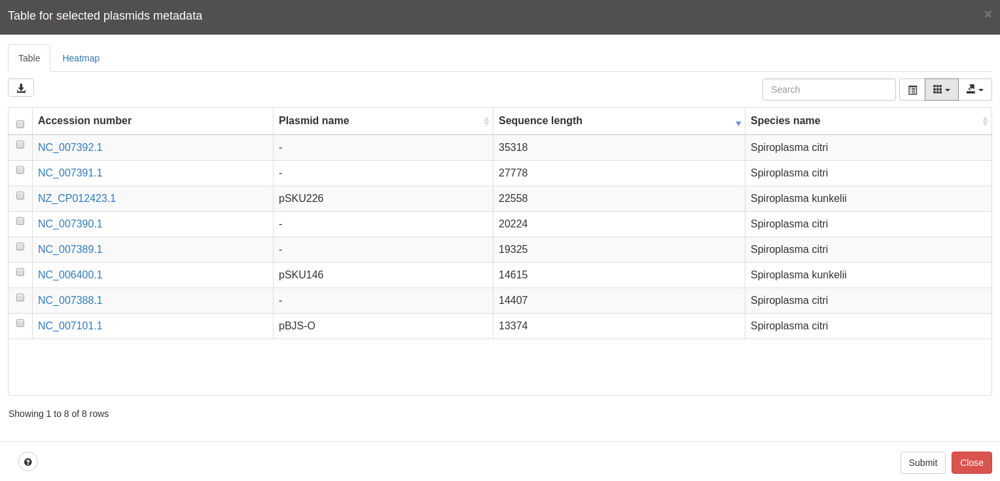
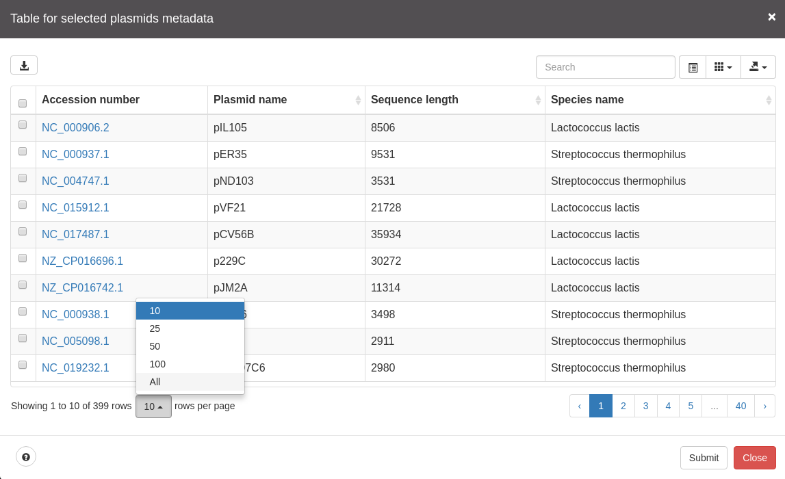

# Table

Table is triggered by clicking in the top navigation bar button for table.
This table allows to display many information regarding the selected plasmids.
By default it will show:

* Accession number
* Plasmid name
* Sequence length
* Species name

As you may have noticed there are a bunch of buttons in this table, so let's dig in.

## Table controls

### Sorting by column

Many column allow to sort by clicking on the respective column header.

### Select using checkboxes

On the left of each row there are checkboxes that allow to make
selections with that entries, that will allow many other commands (e.g.
download selected checkboxes sequences from NCBI eutils)

### Download button

On the top left corner there is a download button that will download every
selected checkbox. This uses something very similar to
[Top Bar Download button](topbar.md#additional-buttons).

### Search box

Located on the top right corner.

Allows to search for a custom set of characters. However, do note that
it searches in all columns.

### Toggle button

Located on the top right corner

Switches table view from column like entries to a more tabular format.
So, suit yourself.

### Displayed columns

The next button will provide the user with the ability to hide or show
additional columns.

### Export

The next button to the right is the export button, which allows you to
export as:

* JSON
* XML
* CSV
* TXT
* SQL
* MS-Excel

#### Export full table

In order to export the full table users must select `ALL` in the
dropdown below the table, which allows to show more rows at once:

And then you can export the table in the desired format as usually.

If `ALL` is not selected, users may end up with a partial table, since
these export features only are able to export what is shown in the table.

### Double click on a cell

Double clicking on a cell will trigger an event that will pass almost
unnoticed for those that are not very familiar with pATLAS. This will
center on the double clicked plasmid and open the popup for that plasmid.